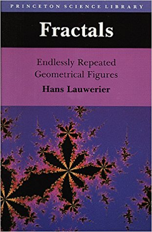

# Fractals

The code presented here is a port of the `code` in the book _Fractals: Endlessly Repeated Geometrical Figures_ by Hans Lauwerier from **`BASIC`** to `javascript`. 

- [TREEH1](treeh1.html)

